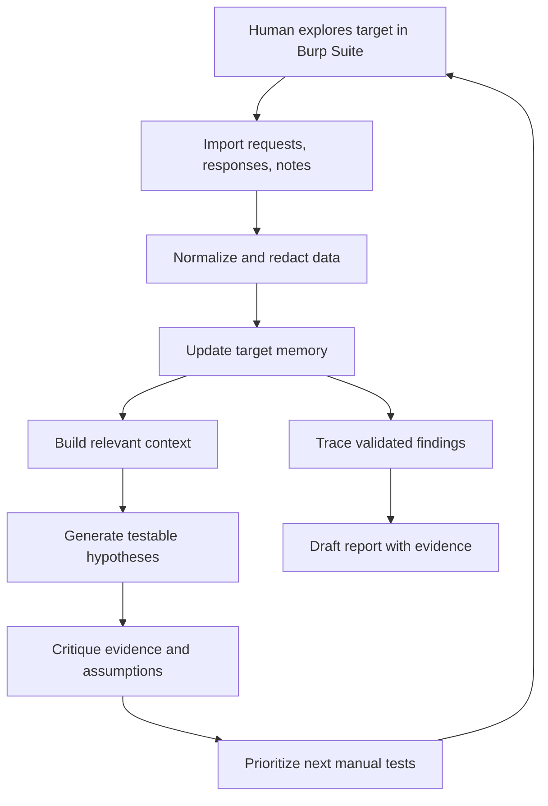

# Ariadne

> A human-guided thread through complex digital systems.

**Ariadne** is a human-in-the-loop cybersecurity research harness designed to preserve context, structure vulnerability research, and turn scattered observations into testable hypotheses.

It is not an autonomous hacker.  
It is not a payload spammer.  
It is not a scanner pretending to be intelligence.

Ariadne exists to help a security researcher navigate complex systems without losing the thread.

---

## Why Ariadne?

In Greek myth, Ariadne gives Theseus a thread so he can enter the labyrinth, face the Minotaur, and find his way back out.

That metaphor defines this project.

```text
Labyrinth       -> complex digital system
Thread          -> persistent research context
Theseus         -> human security researcher
Minotaur        -> hidden vulnerability or unknown behavior
Ariadne         -> guiding intelligence and memory harness
Return path     -> evidence, reproduction steps, and report
```

Ariadne does not replace the researcher.

It gives the researcher the thread.

---

## Core Philosophy

Modern security research does not fail only because of a lack of tools.

It often fails because context gets lost.

A researcher may inspect dozens of endpoints, switch between multiple accounts, test several roles, modify object IDs, compare responses, review JavaScript, examine headers, and repeat similar tests across different flows.

The hard part is not simply generating more payloads.

The hard part is remembering:

- what was tested
- why it was tested
- what changed
- what failed
- what remained uncertain
- what evidence supports a hypothesis
- what evidence weakens it
- what the next best test should be

Ariadne treats **context as the core asset**.

---

## Design Doctrine

Ariadne is built around five principles:

1. **The human holds the thread**  
   The researcher remains responsible for judgment, testing, validation, and escalation.

2. **Context is the foundation**  
   Burp traffic, notes, scope rules, failed tests, hypotheses, object relationships, roles, and evidence must be preserved as structured memory.

3. **Every hypothesis must be testable**  
   The system should not produce vague ideas. It should produce concrete, falsifiable next steps.

4. **Every test must update the map**  
   A failed test is not wasted. It sharpens the model of the target.

5. **Every finding must be traceable**  
   A valid report should have a clear path from observation to hypothesis to test to evidence.

---

## What Ariadne Is

Ariadne is a research harness for scoped cybersecurity work.

Its purpose is to help the researcher:

- import and structure Burp observations
- maintain a living map of the target
- track endpoints, parameters, roles, objects, and auth boundaries
- preserve failed and successful tests
- generate context-aware hypotheses
- critique weak evidence
- prioritize next manual tests
- turn validated findings into clear reports

The goal is not to automate curiosity.

The goal is to compound it.

---

## What Ariadne Is Not

Ariadne is not designed to be:

- a fully autonomous exploitation system
- a mass scanning platform
- a random payload generator
- a replacement for Burp Suite
- a replacement for human judgment
- a black-box “AI finds bugs” tool

If Ariadne produces confidence without evidence, it has failed.

If it generates activity without learning, it has failed.

If it makes the researcher less precise, it has failed.

---

## The Research Loop

Ariadne is built around a tight human-machine feedback loop.



The loop is the product.

Every cycle should make the target map clearer.

---

## The Thread

The central concept in Ariadne is **the Thread**.

The Thread is the living research trail for a target.

It contains:

- scope rules
- endpoints
- parameters
- requests and responses
- authentication flows
- user roles
- object IDs
- tenant boundaries
- observations
- assumptions
- hypotheses
- failed tests
- confirmed facts
- contradictions
- evidence
- report material

The Thread is not a note dump.

It is structured memory.

It should answer:

```text
Where are we?
How did we get here?
What do we know?
What are we assuming?
What have we already tried?
What remains uncertain?
What should we test next?
```

---

## The Labyrinth Map

Ariadne should gradually build a map of the system being tested.

This map may include:

```text
assets
endpoints
methods
parameters
roles
sessions
objects
ownership rules
authorization boundaries
state-changing actions
sensitive data flows
interesting response differences
```

The map is not built for decoration.

It exists to support better hypotheses.

---

## Hypotheses Over Payloads

Ariadne prioritizes hypotheses over payload lists.

A weak system says:

```text
Try these 100 payloads.
```

A stronger system says:

```text
This endpoint accepts an object ID tied to account ownership.
You changed the ID and received a 403.
That does not disprove IDOR yet.
Next, compare same-tenant and cross-tenant object access using two controlled accounts.
```

Payloads are cheap.

Context-aware test selection is valuable.

---

## The Skeptic Is Core

Ariadne must not only suggest paths.

It must challenge them.

The Skeptic component exists to ask:

```text
Is this actually in scope?
Is the evidence strong enough?
Did the researcher change too many variables at once?
Could this response be explained by CSRF, WAF, caching, role mismatch, or missing headers?
Was this already tested?
What would disprove the current hypothesis?
```

Without skepticism, Ariadne becomes a confidence generator.

That is worse than useless.

---

## Human-in-the-Loop by Design

The human researcher remains inside the loop.

Ariadne can suggest, organize, critique, and remember.

The researcher still:

- chooses what to test
- performs manual validation
- interprets business impact
- decides when evidence is sufficient
- controls scope and ethics
- owns the final report

Ariadne is a guide through the maze, not the hero of the story.

---

## Future Modular Design

The core harness should stay modular.

Future components may include:

```text
Recon modules
Payload adaptation modules
Vulnerability-class specialists
JavaScript analysis modules
API analysis modules
Report-writing modules
Tool integrations
Memory retrieval modules
Evaluation modules
```

But these are secondary.

The foundation is the Thread.

Without strong memory, evidence tracking, and context selection, agents only create noise faster.

---

## Product Boundary

Ariadne should be judged by one standard:

> Does it help the researcher maintain a better thread through the target?

If a feature does not improve orientation, memory, hypothesis quality, evidence quality, or report traceability, it does not belong in the core.

---

## One-Sentence Definition

**Ariadne is a human-in-the-loop cybersecurity research harness that preserves target-specific context, generates testable hypotheses, critiques evidence, and helps researchers navigate complex digital systems without losing the thread.**
