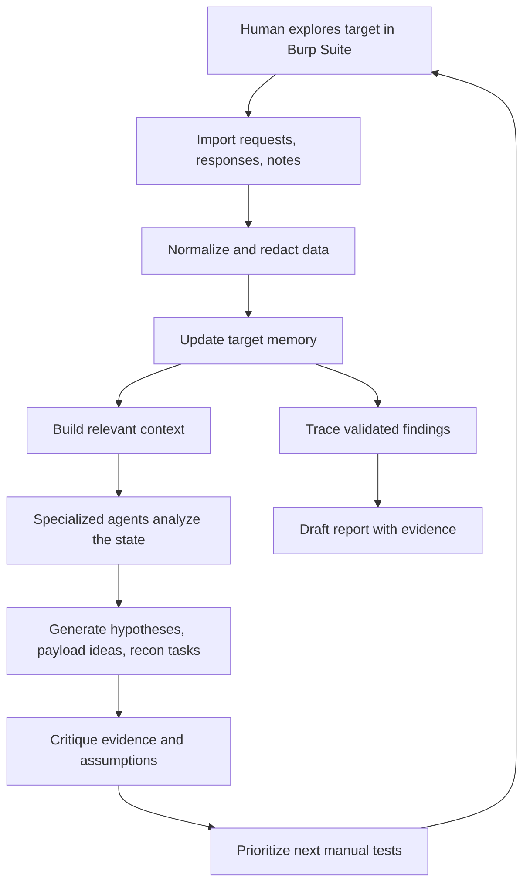

# Ariadne

> A human-guided thread through complex digital systems.

**Ariadne** is a human-in-the-loop cybersecurity research harness designed to augment the capability of a security researcher.

It preserves target context, generates testable hypotheses, suggests creative payload directions, tracks data flow across requests, provides recon support, critiques evidence, and reduces the friction of moving from observation to validated finding.

Ariadne is not an autonomous hacker.

It is a group of specialized research agents organized around one human operator.

The human explores, judges, tests, validates, and reports.

Ariadne remembers, connects, suggests, challenges, and accelerates.

---

## Why Ariadne?

In Greek myth, Ariadne gives Theseus a thread so he can enter the labyrinth, face the Minotaur, and find his way back out.

That metaphor defines this project.

```text
Labyrinth       -> complex digital system
Thread          -> persistent research context
Theseus         -> human security researcher
Minotaur        -> hidden vulnerability or unknown behavior
Ariadne         -> guiding intelligence and agentic research harness
Return path     -> evidence, reproduction steps, and report
```

Ariadne does not replace the researcher.

It gives the researcher the thread, the map, the tools, the suggestions, and the memory required to move through the maze with more force and precision.

---

## Core Philosophy

Modern security research does not fail only because of a lack of tools.

It often fails because the researcher loses context, repeats work, misses relationships between requests, forgets assumptions, or wastes energy translating observations into next actions.

A researcher may inspect dozens of endpoints, switch between multiple accounts, test several roles, modify object IDs, compare responses, review JavaScript, examine headers, and repeat similar tests across different flows.

The hard part is not simply generating more payloads.

The hard part is knowing:

- what to test next
- why that test matters
- which payload family fits the context
- which request influences another request downstream
- which endpoint shares object state with another endpoint
- which behavior is actually interesting
- which evidence supports a vulnerability
- which evidence weakens it
- which path has already failed
- which path is worth revisiting

Ariadne treats **context as the core asset** and **augmentation as the product**.

---

## Design Doctrine

Ariadne is built around seven principles:

1. **The human holds the thread**  
   The researcher remains responsible for judgment, testing, validation, ethics, and escalation.

2. **Context is the foundation**  
   Burp traffic, notes, scope rules, failed tests, hypotheses, object relationships, roles, and evidence must be preserved as structured memory.

3. **Recommendations must be contextual**  
   Suggestions should come from the target state, not from generic vulnerability checklists.

4. **Payloads must be adapted, not spammed**  
   Ariadne should suggest payload families, mutation strategies, and test ideas based on parser behavior, reflection context, auth model, request flow, and previous results.

5. **Every hypothesis must be testable**  
   The system should produce concrete, falsifiable next steps.

6. **Every test must update the map**  
   A failed test is not wasted. It sharpens the model of the target.

7. **Every finding must be traceable**  
   A valid report should have a clear path from observation to hypothesis to test to evidence.

---

## What Ariadne Is

Ariadne is a research harness for scoped cybersecurity work.

Its purpose is to help the researcher:

- import and structure Burp observations
- maintain a living map of the target
- track endpoints, parameters, roles, objects, and auth boundaries
- identify data flow across requests
- preserve failed and successful tests
- generate context-aware hypotheses
- suggest payload directions and mutation ideas
- surface relevant recon tasks and research notes
- critique weak evidence
- prioritize next manual tests
- reduce repetitive research friction
- turn validated findings into clear reports

The goal is not to automate curiosity.

The goal is to compound it.

---

## What Ariadne Is Not

Ariadne is not designed to be:

- a fully autonomous exploitation system
- a mass scanning platform
- a random payload generator
- a replacement for Burp Suite
- a replacement for human judgment
- a black-box “AI finds bugs” tool

If Ariadne produces confidence without evidence, it has failed.

If it suggests payloads without context, it has failed.

If it generates activity without learning, it has failed.

If it makes the researcher less precise, it has failed.

---

## The Research Loop

Ariadne is built around a tight human-machine feedback loop.



The loop is the product.

Every cycle should make the target map clearer and reduce the friction of the next move.

---

## The Thread

The central concept in Ariadne is **the Thread**.

The Thread is the living research trail for a target.

It contains:

- scope rules
- endpoints
- parameters
- requests and responses
- authentication flows
- user roles
- object IDs
- tenant boundaries
- observations
- assumptions
- hypotheses
- payload attempts
- failed tests
- confirmed facts
- contradictions
- evidence
- report material

The Thread is not a note dump.

It is structured memory.

It should answer:

```text
Where are we?
How did we get here?
What do we know?
What are we assuming?
What have we already tried?
What remains uncertain?
Which payload directions fit this context?
Which request affects another request?
What should we test next?
```

---

## The Labyrinth Map

Ariadne should gradually build a map of the system being tested.

This map may include:

```text
assets
endpoints
methods
parameters
roles
sessions
objects
ownership rules
authorization boundaries
state-changing actions
sensitive data flows
request dependencies
interesting response differences
```

The map is not built for decoration.

It exists to support better hypotheses, better recommendations, and better payload selection.

---

## Specialized Agents

Ariadne is designed as a harness for specialized agents.

The first version should keep these agents simple and grounded.

```text
Context Agent
Maintains the target state, known facts, open questions, and contradictions.

Reasoning Agent
Turns observations into testable hypotheses and next-step plans.

Payload Agent
Suggests payload families, mutations, and test ideas based on the current request context.

Recon Agent
Suggests useful recon paths, documentation targets, endpoint discovery ideas, and technology-specific research.

Flow Agent
Tracks relationships between requests, objects, sessions, and downstream effects.

Vulnerability-Class Agents
Apply focused reasoning for classes like IDOR, access control, auth bypass, XSS, SSRF, injection, and business logic flaws.

Skeptic Agent
Challenges weak evidence, checks scope, identifies alternate explanations, and prevents false confidence.

Report Agent
Turns validated evidence into clear reproduction steps, impact, and remediation guidance.
```

Agents are not valuable because there are many of them.

They are valuable only when they reduce friction, sharpen reasoning, preserve context, or improve test selection.

---

## Payloads as Creative Direction

Ariadne should not be a payload dump.

A weak payload system says:

```text
Try these 100 payloads.
```

A stronger payload system says:

```text
This value appears inside a JSON string, then gets passed into a later request.
Raw HTML payloads are probably low value here.
Try testing parser confusion, type confusion, encoding differences, and downstream trust boundaries.
```

The Payload Agent should help the researcher ask:

```text
What kind of input does this parser expect?
Where does this value go next?
Is this reflected, stored, transformed, normalized, or rejected?
Does the same value appear in a later request?
Does changing this field affect authorization, pricing, ownership, or workflow state?
What payload family fits this exact behavior?
```

The goal is not more payloads.

The goal is better payload choice.

---

## Recon as Research Support

Ariadne should also reduce the friction of recon.

Recon is not just collecting subdomains.

Recon includes understanding:

- the application’s architecture
- public documentation
- API behavior
- JavaScript routes
- framework-specific patterns
- technology-specific vulnerability history
- exposed integrations
- authentication flows
- business logic and object relationships

Ariadne should help gather, summarize, and connect recon material to the current target state.

Recon should feed the Thread.

The Thread should improve recon.

---

## The Skeptic Is Core

Ariadne must not only suggest paths.

It must challenge them.

The Skeptic component exists to ask:

```text
Is this actually in scope?
Is the evidence strong enough?
Did the researcher change too many variables at once?
Could this response be explained by CSRF, WAF, caching, role mismatch, or missing headers?
Was this already tested?
What would disprove the current hypothesis?
Is the payload idea appropriate for this context?
Is this recommendation based on evidence or generic pattern matching?
```

Without skepticism, Ariadne becomes a confidence generator.

That is worse than useless.

---

## Human-in-the-Loop by Design

The human researcher remains inside the loop.

Ariadne can suggest, organize, critique, research, remember, and recommend.

The researcher still:

- chooses what to test
- performs manual validation
- interprets business impact
- decides when evidence is sufficient
- controls scope and ethics
- owns the final report

Ariadne is a guide through the maze, not the hero of the story.

---

## Future Modular Design

The core harness should stay modular.

Future components may include:

```text
Recon modules
Payload adaptation modules
Vulnerability-class specialists
JavaScript analysis modules
API analysis modules
Data-flow analysis modules
Report-writing modules
Tool integrations
Memory retrieval modules
Evaluation modules
Fine-tuned models, if justified by collected data
```

But these are secondary.

The foundation is the Thread.

Without strong memory, evidence tracking, context selection, and feedback from manual testing, agents only create noise faster.

---

## Product Boundary

Ariadne should be judged by one standard:

> Does it help the researcher maintain a better thread through the target and move from observation to testable action with less friction?

If a feature does not improve orientation, memory, hypothesis quality, payload selection, recon direction, evidence quality, or report traceability, it does not belong in the core.

---

## One-Sentence Definition

**Ariadne is a human-in-the-loop cybersecurity research harness that coordinates specialized agents to preserve target-specific context, suggest creative tests and payload directions, critique evidence, and help researchers navigate complex digital systems without losing the thread.**
